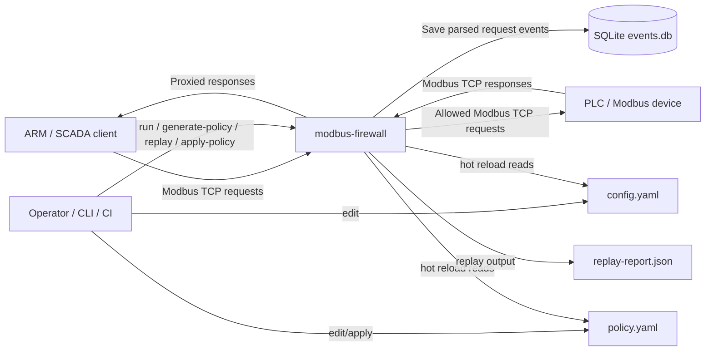
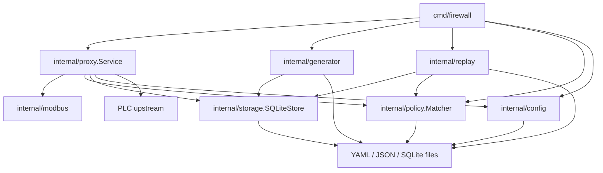
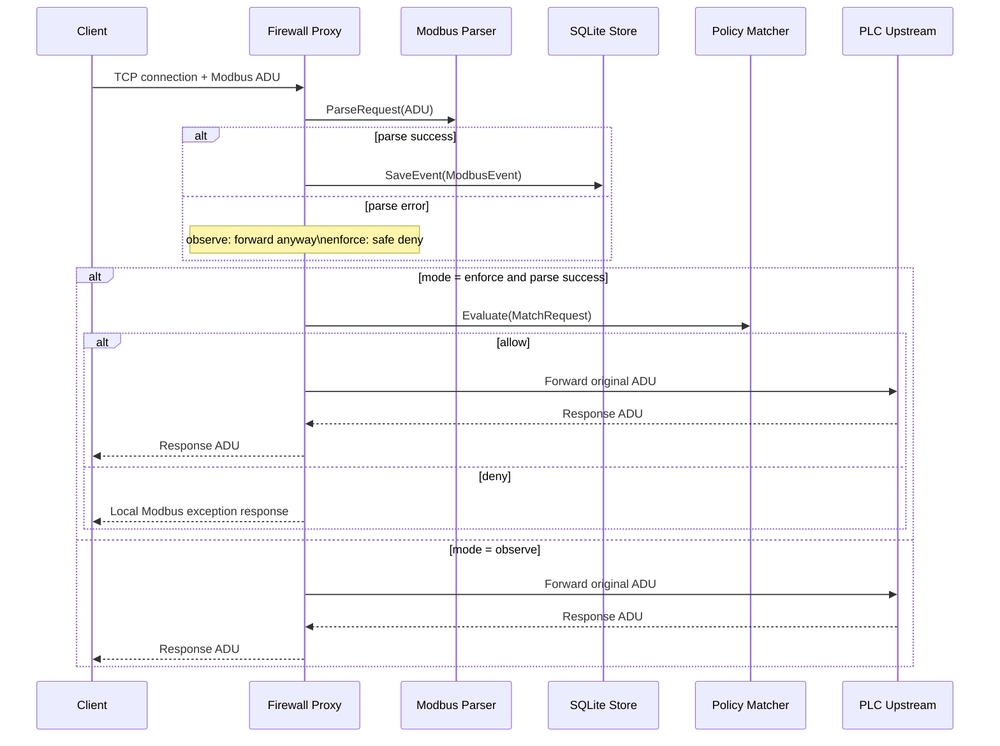
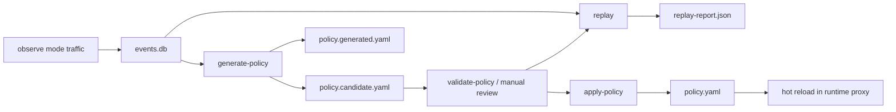
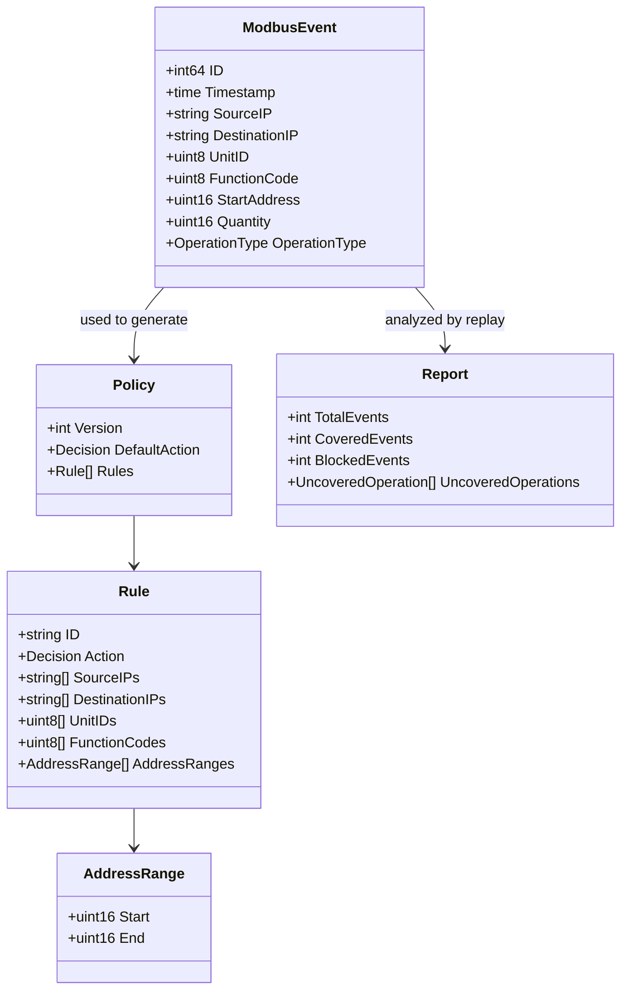
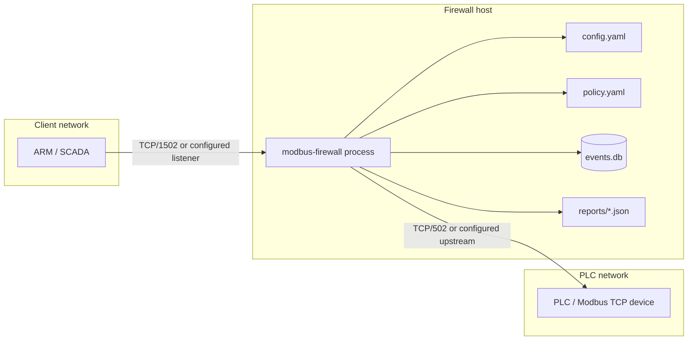

# HLD: `modbus-firewall`

## 1. Цель HLD

Этот документ описывает высокоуровневую архитектуру `modbus-firewall` на основе текущей реализации в репозитории. Акцент сделан на:

- границах сервиса;
- взаимодействии с внешними компонентами;
- жизненном цикле policy;
- данных, которые сервис хранит локально;
- ключевых технических ограничениях.

## 2. Архитектурный контекст

### Контекстное описание

- Клиент никогда не должен обращаться к PLC напрямую; точка входа — firewall proxy.
- Сервис принимает решение локально, без внешнего authorization service.
- Состояние сервиса делится на:
  - runtime state в памяти;
  - события в SQLite;
  - policy/config/report как file-based артефакты.

## 3. Компонентная модель

### Компоненты и роли

| Компонент | Роль |
|---|---|
| `cmd/firewall` | orchestration-слой CLI и точка входа |
| `internal/proxy.Service` | online data plane: listener, сессии, proxy loop, hot reload |
| `internal/modbus` | нормализация Modbus TCP запроса до полей policy-матчинга |
| `internal/policy.Matcher` | policy decision engine |
| `internal/storage.SQLiteStore` | persistence для истории запросов |
| `internal/generator` | policy synthesis из observed событий |
| `internal/replay` | offline coverage-анализ policy |
| `internal/config` | загрузка и семантическая валидация runtime-конфига |

## 4. Логическая декомпозиция по потокам

### 4.1. Online request path

### 4.2. Policy lifecycle

## 5. Runtime state model

### In-memory state

Основной runtime state прокси:

- `Mode`
  - `observe`
  - `enforce`
- `Matcher`
  - активный policy engine;
  - может отсутствовать в `observe`.

Это состояние хранится в `atomic.Pointer[runtimeState]`, что позволяет обновлять режим и matcher без остановки listener и без глобальной блокировки на каждую операцию.

### Connection model

- На каждое клиентское TCP-соединение создается отдельная goroutine.
- Для каждого connection отдельно создается upstream TCP-соединение к PLC.
- Внутри connection запросы обрабатываются последовательно в цикле `read -> parse -> save -> decide -> forward/block -> return`.

Следствие:

- сервис естественно масштабируется по числу concurrent connections;
- решение по новому запросу в том же socket может использовать уже обновленный runtime state после hot reload.

## 6. Модель данных

### 6.1. Persisted data

### 6.2. Что реально хранится

| Объект | Где хранится | Комментарий |
|---|---|---|
| `ModbusEvent` | SQLite `modbus_events` | основная историческая сущность |
| `Policy` | YAML files | active/candidate/generated policy |
| `Report` | JSON file | сохраняется только по запросу |

### 6.3. Что не хранится как отдельная сущность

| Объект | Статус |
|---|---|
| `ParsedRequest` | transient, живет в рамках обработки одного запроса |
| `MatchRequest` | transient, формируется только для matcher |
| `runtimeState` | transient, текущая конфигурация процесса |
| `PolicyCandidate` | transient aggregation DTO |

## 7. Взаимодействия с внешними компонентами

### 7.1. Клиентский контур

- Транспорт: TCP.
- Прикладной протокол: Modbus TCP.
- Инициатор соединения: клиент.
- Сервис слушает `server.listen_addr`.

### 7.2. PLC контур

- Транспорт: TCP.
- Инициатор соединения: firewall.
- Целевой адрес: `proxy.upstream_addr`.
- Разрешенные запросы проксируются без изменения исходного ADU.

### 7.3. Хранилище

- Локальная SQLite БД в файле `storage.events_path`.
- Один RW connection pool с `SetMaxOpenConns(1)`.
- Подходит для single-instance deployment.

### 7.4. Файлы policy/config/report

- `config.yaml` и `policy.yaml` читаются при старте.
- При включенном hot reload читаются повторно по таймеру.
- `apply-policy` и `reset-candidate` используют атомарную замену файла через временный файл + `rename`.

## 8. Sequence по режимам

### 8.1. Observe mode

Свойства:

- не принимает блокирующих policy-решений;
- использует parser и storage;
- upstream остается source of truth по фактическому ответу.

Риск/компромисс:

- сервис сохраняет только метаданные запроса, поэтому будущая policy не учитывает значения записываемых регистров.

### 8.2. Enforce mode

Свойства:

- policy действует как allowlist;
- default deny обязателен;
- запрос, не покрытый policy, до PLC не доходит.

Отдельное поведение:

- при policy deny клиент получает Modbus exception response;
- при parse error происходит safe deny, без проксирования в upstream.

## 9. Deployment view

Для локального стенда в репозитории используется отдельный Compose deployment:

- `arm-sim` на `10.10.0.2`
- `firewall` на `10.10.0.4:1502`
- `plc-sim` на `10.10.0.3:502`

## 10. Ключевые архитектурные решения

### Решение 1. Прокси на application layer, а не packet filter

Причина:

- policy зависит от `function_code`, `unit_id`, `start_address`, `quantity`;
- эти признаки доступны только после разбора Modbus PDU.

### Решение 2. Allowlist policy с `default_action=deny`

Причина:

- сервис должен быть fail-safe и блокировать неизвестные операции;
- это соответствует промышленному сценарию защиты PLC.

### Решение 3. SQLite как локальное хранилище

Причина:

- минимальная операционная сложность;
- достаточно для MVP и single-node стенда;
- легко переносить вместе с сервисом.

Ограничение:

- не подходит как shared store для нескольких инстансов.

### Решение 4. Hot reload через polling файлов

Причина:

- не нужен отдельный control plane;
- можно менять policy без рестарта процесса.

Ограничение:

- консистентность зависит от корректной атомарной замены файлов;
- reload не является транзакцией между несколькими узлами, потому что узел один.

## 11. Нефункциональные свойства

### Надежность

- Ошибка сохранения события не валит proxy.
- Ошибка policy при hot reload не должна останавливать listener; сервис продолжает жить на предыдущем runtime state.
- Ошибка парсинга в `enforce` приводит к безопасному отказу, а не к проксированию запроса.

### Производительность

- Нет тяжелого внешнего RPC на каждый запрос.
- На каждый запрос есть парсинг, локальное сохранение события и, в `enforce`, matcher lookup.
- Hot reload вынесен в отдельный periodic loop.

### Управляемость

- Все основные операции доступны через CLI.
- Конфигурация и policy хранятся в обычных файлах.
- Replay позволяет оценить последствия включения `enforce` заранее.

## 12. Ограничения и риски

| Область | Ограничение |
|---|---|
| Policy scope | только exact IP, без CIDR |
| Storage | только локальная SQLite |
| Scale | нет multi-instance coordination |
| Security transport | нет TLS/mTLS |
| Domain depth | policy не анализирует значения payload как бизнес-смысл |
| Audit depth | ответы PLC и payload write-values не сохраняются |
| Simulator parity | `plc-sim` покрывает не все FC, которые умеет firewall |

## 13. Итог

`modbus-firewall` реализован как single-process Modbus TCP policy enforcement proxy с локальным event store, файловой policy и поддержкой итеративного цикла:

`observe -> generate-policy -> replay -> apply -> enforce`

Это хороший MVP-дизайн для локального стенда, пилота или single-node промышленного сегмента, если допустимы ограничения:

- локальное состояние;
- точечные IP в policy;
- отсутствие централизованного control plane;
- file-based управление policy.
